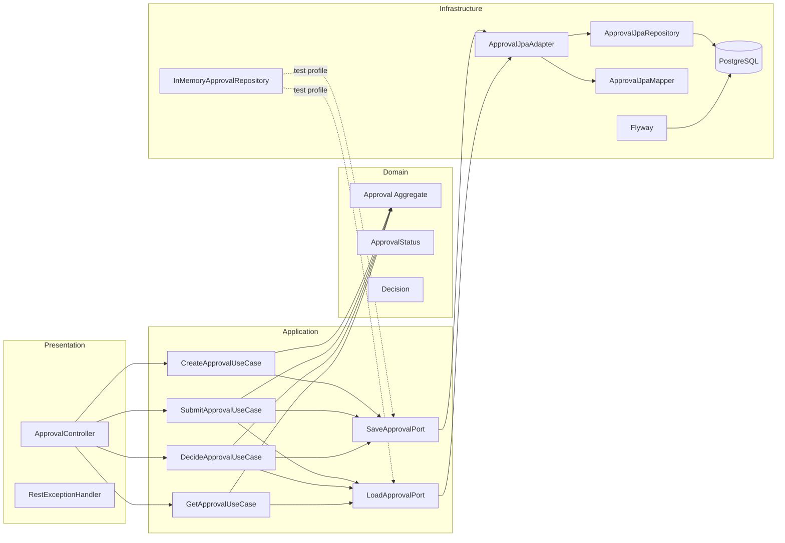

# ApproveFlow

Enterprise-style Approval Workflow System built with Java 25 and Spring Boot 4.


---

## 🚀 Overview

ApproveFlow is a domain-driven approval workflow system designed in enterprise architecture style.

The goal of this project is to demonstrate:

- Clean layered architecture (Domain / Application / Infrastructure)
- Domain-driven design principles
- CI with GitHub Actions
- Database migrations with Flyway
- Integration testing with Testcontainers
- Production-ready structure

---

## 🏗 Architecture

The project follows a domain-first layered structure:

```
shared/
domain/
application/
infrastructure/
```

- **domain** – core business logic  
- **application** – use cases and ports  
- **infrastructure** – REST layer, persistence, configuration  
- **shared** – reusable primitives (id, time, errors)

---

## 🧭 Architecture Diagram



---

## 🛠 Tech Stack

- Java 25
- Spring Boot 4
- Maven
- PostgreSQL
- Flyway
- Testcontainers
- Docker
- GitHub Actions (CI)

---

## ▶ Run Locally

### 1️⃣ Start database

```bash
docker compose up -d
```

### 2️⃣ Run application

```bash
./mvnw spring-boot:run
```

Application will start on:

```
http://localhost:8080
```

---

## 📘 API Documentation (OpenAPI)

After starting the application, API documentation is available at:

- Swagger UI: http://localhost:8080/swagger-ui.html
- OpenAPI spec (JSON): http://localhost:8080/v3/api-docs

> Endpoints are available only when the application is running.

---

## 🧪 Run Tests

```bash
./mvnw clean verify
```

CI automatically runs build + tests on every push to `master`.

---

## 📦 MVP Release

Version `v1.0.0` includes:

- ✅ GitHub Actions CI (build + tests)
- ✅ Clean layered architecture
- ✅ Persistence layer (JPA + Flyway)
- ✅ Integration tests
- ✅ Dockerized database
- ✅ Documentation

### Definition of Done

- All CI checks are green  
- Application starts locally  
- Documentation is up to date  

---

## 📌 Project Purpose

This project is part of a backend engineering portfolio and demonstrates production-style architecture and CI/CD workflow.
